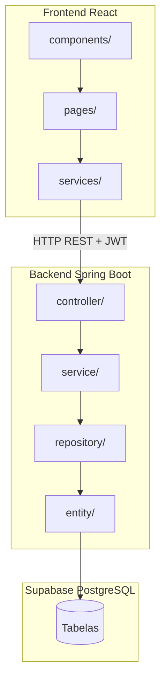
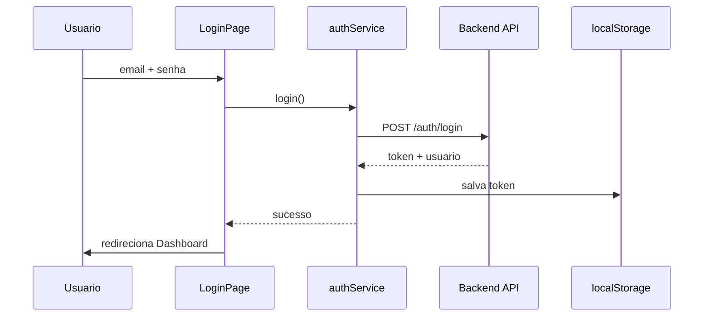

# Arquitetura — Sistema de Escalas Militares

## Visão geral

Monorepo com frontend React e backend Spring Boot, comunicando via API REST. O banco PostgreSQL é hospedado no Supabase.



## Camadas do backend

| Camada | Pacote | Responsabilidade |
|--------|--------|------------------|
| Controller | `controller/` | Recebe requisições HTTP, valida DTOs, retorna respostas. **Sem** acesso a repository ou regra de negócio. |
| Service | `service/` | **Toda** regra de negócio. Orquestra repositories e validações de domínio. |
| Repository | `repository/` | Acesso a dados via Spring Data JPA. |
| Entity | `entity/` | Mapeamento ORM das tabelas PostgreSQL. |
| DTO | `dto/` | Objetos de transferência (request/response) com Bean Validation. |
| Config | `config/` | Security (JWT + BCrypt), CORS, propriedades. |
| Exception | `exception/` | Exceções customizadas e `GlobalExceptionHandler`. |
| Util | `util/` | Utilitários (geração/validação JWT, etc.). |

### Fluxo de uma requisição

```text
HTTP Request
    → Controller (valida DTO)
    → Service (regra de negócio)
    → Repository (persistência)
    → PostgreSQL
    ← Entity/DTO
    ← Response JSON
```

## Camadas do frontend

| Pasta | Responsabilidade |
|-------|------------------|
| `pages/` | Telas da aplicação. **Nunca** fazem HTTP direto. |
| `components/` | Componentes reutilizáveis (Layout, Input, Button, etc.). |
| `services/` | **Única** camada que comunica com a API. |
| `types/` | Interfaces TypeScript espelhando DTOs do backend. |
| `assets/` | Imagens, ícones e recursos estáticos. |

### Fluxo de autenticação



## Segurança

- **JWT**: token Bearer no header `Authorization`.
- **BCrypt**: hash de senhas no banco.
- **Spring Security**: filtro JWT valida token em rotas protegidas.
- Rotas públicas: `POST /api/auth/login`.

## Convenções de código

### Backend (Java)

- Toda classe com Javadoc (responsabilidade, fluxo).
- Comentários inline em lógica não óbvia.
- DTOs obrigatórios — nunca expor entities diretamente.
- Bean Validation (`@NotBlank`, `@Email`, etc.) nos DTOs de entrada.

### Frontend (TypeScript)

- Comentários em services e componentes complexos.
- Tipos explícitos para requests/responses.
- Context API para estado de autenticação.

### Banco de dados

- Scripts versionados em `database/migrations/`.
- Toda tabela: PK, FKs, índices, constraints.
- UUIDs como chaves primárias.

## Git Flow

- `main`: produção estável.
- `develop`: integração.
- Feature branches: `feat/nome-da-feature`.
- Commits: Conventional Commits.

## Estado atual (scaffold)

| Componente | Status |
|------------|--------|
| Auth JWT completo | Implementado |
| CRUD militares | Stub (lista vazia) |
| Escalas | Stub |
| Trocas / Faltas | Stub |
| Relatórios | Stub |
| Testes automatizados | Pendente |
