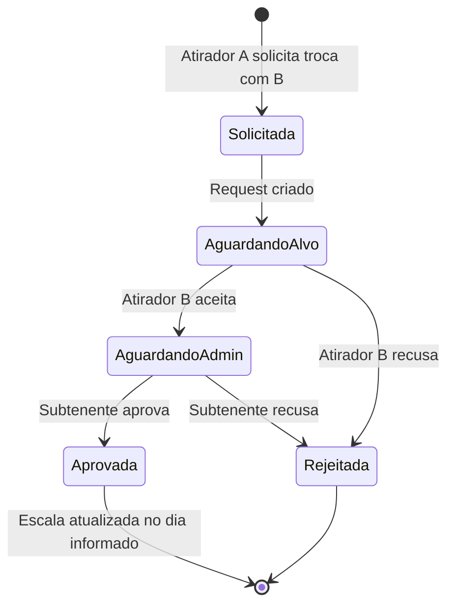

# Domínio — Regras de Negócio das Escalas

Documento derivado de [`Documento Escalas.docx`](Documento%20Escalas.docx) e [`PROMPT_MASTER_CURSOR.md`](PROMPT_MASTER_CURSOR.md).

## Glossário

| Termo | Definição |
|-------|-----------|
| Escala preta | Escala de serviço em dias úteis (segunda a sexta, exceto feriados). |
| Escala vermelha | Escala de serviço em fins de semana e feriados (24h). |
| Atirador | Militar escalado para serviço. |
| Monitor | Militar com escala diferenciada (1 por dia). |
| Comandante da guarda | Função na escala (1 por dia). |
| Cabo de dia | Função na escala, também atirador (1 por dia). |
| Subtenente | Administrador que aprova trocas de serviço. |
| Reserva | Militar disponível para substituição em caso de falta. |

## Escala preta

### Parâmetros

- Numeração de **1 a 150** (dias da escala).
- **11 pessoas por dia**:
  - 1 comandante da guarda
  - 1 cabo de dia (atirador)
  - 9 demais atiradores (padrão)
- **Monitores**: escala separada — apenas **1 monitor por dia**.
- **Intervalo mínimo**: 48 horas entre serviços para o mesmo militar.

### Regras de rotação (a implementar)

1. A rotação avança sequencialmente de 1 a 150 e reinicia.
2. Militares em reserva não entram na rotação automática.
3. O sistema deve respeitar o intervalo de 48h ao atribuir serviço.
4. Monitores seguem rotação própria (1/dia).

## Escala vermelha

### Parâmetros

- Aplica-se a **fins de semana** e **feriados**.
- Serviço de **24 horas**.
- Funciona de forma análoga à escala preta, porém com **rotação independente**.

### Regras (a implementar)

1. Identificar automaticamente sábados, domingos e datas em `feriados`.
2. Manter fila de rotação separada da escala preta.
3. Mesmas funções (comandante, cabo de dia, atiradores).

## Troca de serviço

### Fluxo

### Regras

1. O solicitante informa seu **número** e o **número** do militar com quem deseja trocar.
2. O militar alvo deve **aceitar** a troca.
3. O **administrador (Subtenente)** deve **aprovar**.
4. A troca afeta **apenas o dia informado** — demais dias permanecem inalterados.

## Controle de faltas

### Tipos

| Tipo | Comportamento |
|------|---------------|
| Falta justificada | Nome permanece na escala. Nenhum substituto é puxado. Militar não é prejudicado. |
| Falta sem justificativa | Nome aparece em **vermelho** na escala. Botão para puxar substituto (reserva ou indicado pelo admin). |

### Regras (a implementar)

1. Admin registra o tipo de falta no dia do serviço.
2. Falta não justificada: sistema sugere militares de reserva.
3. Substituto assume a função no dia específico.

## Feriados

- Cadastro de datas em tabela `feriados`.
- Feriados disparam escala vermelha automaticamente.

## Funcionalidades futuras

- **Pedido de marmitas**: feature planejada, fora do escopo atual.

## Entidades do domínio (modelo de dados)

| Entidade | Descrição |
|----------|-----------|
| `usuarios` | Credenciais e papel (ADMINISTRADOR, MILITAR). |
| `militares` | Dados do militar (número, nome, tipo, posto, reserva). |
| `escalas` | Instância de escala (preta ou vermelha, período). |
| `escala_dias` | Dia específico dentro de uma escala. |
| `escala_atribuicoes` | Militar + função em um dia. |
| `trocas_servico` | Solicitações de troca com status. |
| `faltas` | Registro de falta com tipo e substituto opcional. |
| `feriados` | Datas de feriado nacional/local. |

## Status de implementação

| Regra | Status |
|-------|--------|
| Modelo de dados (SQL) | Implementado (V001) |
| Auth e papéis | Implementado |
| Rotação escala preta | Pendente |
| Rotação escala vermelha | Pendente |
| Fluxo de troca completo | Pendente |
| UI faltas (vermelho + substituto) | Pendente |
| Relatórios | Pendente |
